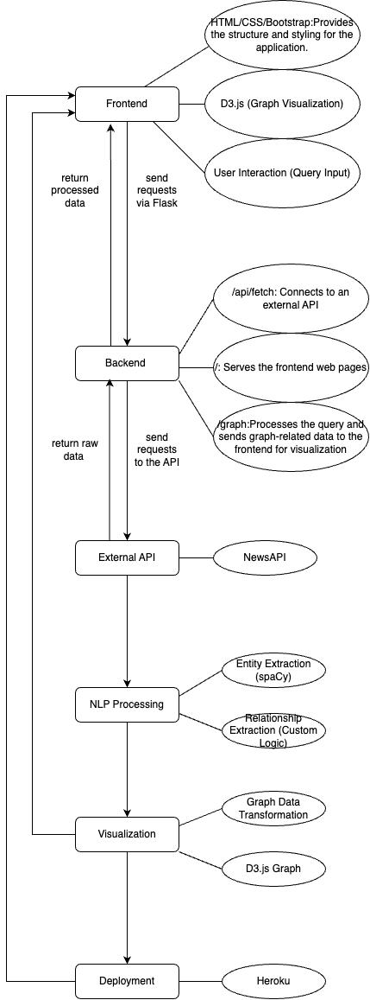
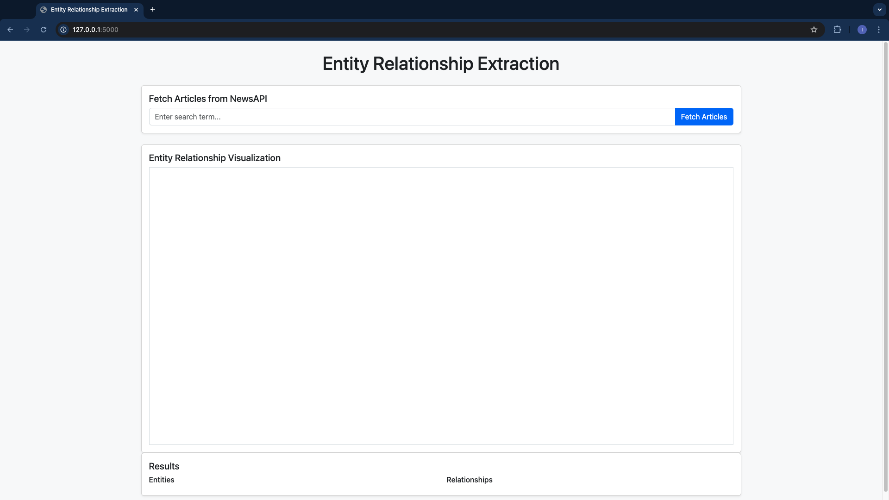
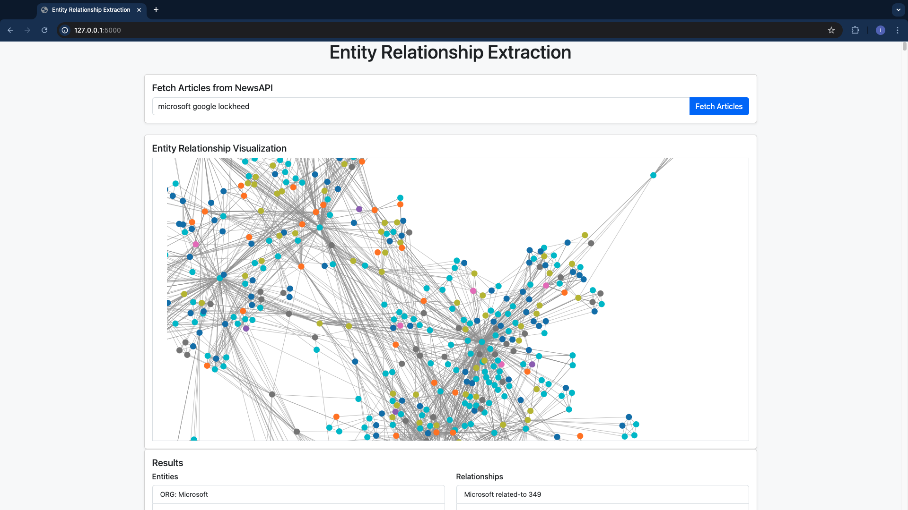

# Entity Relationship Extraction Web App

#### Project by: Isfar Baset, Liz Kovalchuk and Xinyue Zhang

This web application extracts entities and relationships from NewsAPI articles and visualizes them in an intuitive interface. It demonstrates the application of Natural Language Processing (NLP) to real-world text data and offers interactive features for exploring relationships between entities.

---

## Features

- **Article Fetching**: Fetch articles dynamically from NewsAPI based on a user-provided search query.
- **Entity Extraction**: Automatically identify entities such as persons, organizations, dates, and more from the fetched articles using NLP techniques.
- **Relationship Extraction**: Extract relationships between identified entities, showing how entities are connected within the text.
- **Graphical Visualization**: Visualize extracted relationships in an interactive graph for better insights.
- **User-Friendly Interface**: A clean and responsive interface built with Bootstrap for easy interaction and exploration of results.

---

## Technologies Used

- **Frontend**:
  - HTML5, CSS3, and Bootstrap for UI/UX design.
  - JavaScript for client-side functionality.
- **Backend**:
  - Flask for handling server requests and responses.
  - NewsAPI for fetching articles based on user queries.
  - NLP libraries for entity and relationship extraction.
- **Visualization**:
  - D3.js-based visualization for dynamically displaying relationships between entities in an interactive graph.
- **Deployment**:
  - Hosted on Heroku for easy access and scalability.

---

## Project Structure

```
Frontend
  ├── HTML/CSS/Bootstrap
  ├── D3.js (Graph Visualization)
  └── User Interaction (Query Input)
       ↓
Backend (Flask)
  ├── /api/fetch
  ├── /
  └── /graph
       ↘
External API (NewsAPI)
       ↘
NLP Processing
  ├── Entity Extraction (spacy)
  └── Relationship Extraction (Custom Logic)
       ↘
Visualization
  ├── Graph Data Transformation
  └── D3.js Graph
       ↘
Deployment (Heroku)
```



## Installation and Setup

Follow these steps to set up and run the web application locally:

1. **Clone the Repository**:
    ```bash
    git clone <repository-url>
    cd <repository-directory>
    ```

2. **Install Dependencies**:
    Make sure Python is installed on your system. Then install the required libraries:
    ```bash
    pip install -r requirements.txt
    ```

3. **Set up API Key**:
    Obtain an API key from [NewsAPI](https://newsapi.org/) and add it to the `.env` file in the root directory:
    ```
    NEWS_API_KEY=your_api_key
    ```

4. **Run the Application**:
    Start the Flask server:
    ```bash
    python app.py
    ```
    The application will be accessible at `http://127.0.0.1:5000`.

5. **Access the Web App**:
    Open your browser and navigate to `http://127.0.0.1:5000`.

---

## Heroku Deployment

The web application has been deployed on Heroku for easy accessibility. You can access it at the following link:

[Entity Relationship Extraction Web App on Heroku](https://fathomless-reaches-11453-26072a1d8f9e.herokuapp.com/)

---

## Usage

1. **Enter a Search Query**:
    - Type a keyword or phrase in the input box (e.g., "Microsoft") and click **Fetch Articles**. The search engine handles multiple entity relationships (e.g., "Microsoft" and "Google").
  
2. **View Results**:
    - Entities and relationships extracted from the fetched articles will be displayed in the results section.

3. **Visualize Relationships**:
    - A graphical representation of the relationships between entities is shown in the "Entity Relationship Visualization" section. Hovering over nodes displays the associated labels.

4. **Explore Further**:
    - Modify the query and explore the results dynamically.

---

## Potential Use Cases

- **Journalism and Media Analysis**:
  - Extract entities and relationships from news articles for trend analysis or fact-checking.

- **Knowledge Graph Construction**:
  - Populate knowledge graphs with entity-relationship data from text sources. This can help visualize relationships between entities and nodes, providing surprising insights.

- **Market Research**:
  - Identify relationships between products, brands, and competitors. Linkages between companies or brands can reveal valuable insights.

- **Education and Demonstration**:
  - Serve as a teaching tool for NLP concepts like Named Entity Recognition (NER) and Relationship Extraction.

---

## Limitations and Future Enhancements

### Current Limitations:
- Basic relationship extraction may not capture nuanced or complex relationships.
- The app currently relies on general-purpose NLP models and may need tuning for domain-specific tasks.

### Future Enhancements:
- **Model Improvements**:
  - Integrate advanced NLP models like BERT, GPT, or domain-specific transformers for improved accuracy.
- **Additional Data Sources**:
  - Extend support to other text sources such as uploaded documents or live web scraping.
- **Graph Interactivity**:
  - Add features like zoom, pan, and node-click details in the visualization graph.
- **Multi-language Support**:
  - Enable processing of text in multiple languages.
- **Scalability**:
  - Deploy as a cloud-based app with public API endpoints for broader accessibility.

---

## Documentation

The project documentation, including API references and tutorials, is built using Sphinx. You can view the HTML documentation locally:

1. Navigate to the `docs` directory:
    ```bash
    cd docs
    ```

2. Build the HTML documentation:
    ```bash
    poetry run make html
    ```

3. Open the generated documentation in your browser:
    ```bash
    open _build/html/index.html
    ```

Alternatively, you can directly open the `index.html` file located in the `_build/html` directory of the `docs` folder.

---

## Screenshots

### Main Interface
The user interface includes sections for entering a query, viewing extracted results, and visualizing relationships.



### Results
Entities and relationships extracted from articles are displayed in a clean format for easy readability.



---

## Credits

- Developed using Flask and Bootstrap.
- Powered by NewsAPI and Python NLP libraries.
- Visualization implemented using D3.js with dynamic SVG rendering.

---

## License

This project is licensed under the MIT License. See the `LICENSE` file for details.
